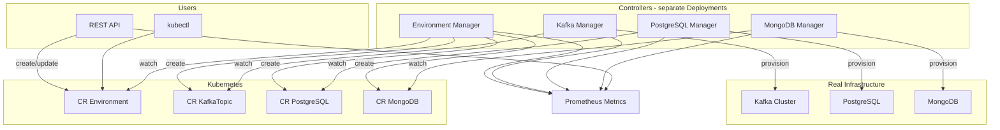

# ShipperCD Plan - Kubernetes Infrastructure Platform

## Project Summary (from [plan.txt](plan.txt))

- **Goal**: Deployable tool on Kubernetes, mono-repo, multiple microservices
- **Technology controllers**: Kafka, PostgreSQL, MongoDB — create databases and topics
- **Environment controller**: Main entity; the `Environment` CR declares databases/topics and creates the CRs for each technology
- **API**: Manage environments (CRUD, limits) without going directly through kubectl
- **Metrics**: Exposed by the API and controllers for dashboards (state, count, status per technology)
- **Context**: First personal project, DevOps engineer beginner in Go/Python — learning is as important as the project

---

## Recommendation: Language and Stack

**Go for the entire project** — aligned with the Kubernetes ecosystem:

- **Kubebuilder** — primary framework for scaffolding CRDs, controllers, and project structure
- **Provisioning** — custom logic in each controller (no external operators). Use existing client libraries:
  - **Kafka**: [Sarama](https://github.com/IBM/sarama) — create topics via Admin API
  - **PostgreSQL**: [pgx](https://github.com/jackc/pgx) or `database/sql` — create databases and users via SQL
  - **MongoDB**: [mongo-go-driver](https://github.com/mongodb/mongo-go-driver) — create databases and users via API
- API: `gin` or `echo` (simple) or `go-zero` (more structured)
- Metrics: `prometheus/client_golang`
- Single language to master, good documentation and examples for K8s operators

**API**: Go (gin/echo) — same language as controllers for consistency.

---

## Kubebuilder Usage

Kubebuilder will be used to scaffold and maintain all controllers and Custom Resource Definitions (CRDs). Key commands and workflow:

- **Initialize project**: `kubebuilder init --domain envcd.io`
- **Create new API + controller**: `kubebuilder create api --group core --version v1alpha1 --kind Environment`
- **Add another API** (same project): `kubebuilder create api --group kafka --version v1alpha1 --kind KafkaTopic`
- **Generate CRD manifests**: `make manifests`
- **Generate deepcopy/runtime code**: `make generate`
- **Install CRDs locally**: `make install`
- **Run controller locally**: `make run`

**Mono-repo strategy**: Use a single Kubebuilder project. Run `kubebuilder create api` once per resource type (Environment, KafkaTopic, PostgreSQL, MongoDB). Kubebuilder generates all types and controllers in one place. For deployment, each controller runs in its own manager process and Deployment (see below).

**What Kubebuilder generates**:

- CRD types in `api/<group>/<version>/`
- Controller skeleton in `controllers/`
- CRD YAML in `config/crd/bases/`
- RBAC, Webhook configs in `config/`
- Default `main.go` with all controllers (used for local dev with `make run`)

---

## One Manager per Controller (Separate Deployments)

Each controller is deployed as its own Kubernetes Deployment with its own manager process. This allows independent scaling, rollout, and failure isolation.

**Approach**: Single Kubebuilder project, multiple entry points. Keep the shared `api/`, `controllers/`, and `config/crd/`, but add separate `main.go` files that each run only one controller.

**Entry points**:

- `cmd/environment-manager/main.go` — runs only Environment controller (creates child CRs)
- `cmd/kafka-manager/main.go` — runs only KafkaTopic controller
- `cmd/postgresql-manager/main.go` — runs only PostgreSQL controller
- `cmd/mongodb-manager/main.go` — runs only MongoDB controller
- `cmd/api-server/main.go` — REST API (not a controller)

**Implementation**: Each `cmd/*-manager/main.go` creates a `manager.Manager`, registers the full scheme (all CRD types), and adds only its controller via `controller.New()`. The default Kubebuilder `main.go` can remain for local dev (`make run` runs all controllers in one process).

**RBAC**: Create separate ClusterRole/ServiceAccount per manager, scoped to only the resources that controller needs. Example: environment-manager needs full access to Environment + create/update/delete on KafkaTopic, PostgreSQL, MongoDB; kafka-manager needs only get/list/watch/update on KafkaTopic.

**Build**: Add Makefile targets or Dockerfiles per manager, e.g. `make build-environment-manager`, `make build-kafka-manager`, or a single Dockerfile with multi-stage builds per binary.

---

## Provisioning Strategy: In-House Logic (No External Operators)

All provisioning logic is developed in-house. Controllers connect directly to Kafka, PostgreSQL, and MongoDB using existing Go libraries — no delegation to operators like Strimzi or CloudNativePG.

**Libraries**:

- **Kafka**: [Sarama](https://github.com/IBM/sarama) — create topics via Admin API (`CreateTopic`), manage partitions and replication
- **PostgreSQL**: [pgx](https://github.com/jackc/pgx) or standard `database/sql` — execute `CREATE DATABASE`, `CREATE USER`, `GRANT` via raw SQL
- **MongoDB**: [mongo-go-driver](https://github.com/mongodb/mongo-go-driver) — create databases and users via MongoDB API

**CRD spec**: Each technology CR (e.g. `KafkaTopic`) includes connection details (broker URLs, DB host, credentials from Secret refs) so the controller knows where to provision. Credentials are read from Kubernetes Secrets.

---

## Target Architecture



---

## Proposed Mono-Repo Structure (Kubebuilder + Multi-Manager)

Kubebuilder generates shared types and controllers. Each controller has its own entry point and deployment.

```
shippercd/
├── api/                              # Kubebuilder-generated CRD types (shared)
│   ├── core/v1alpha1/
│   ├── kafka/v1alpha1/
│   ├── postgresql/v1alpha1/
│   └── mongodb/v1alpha1/
├── controllers/                      # Kubebuilder-generated controllers (shared)
│   ├── environment_controller.go
│   ├── kafkatopic_controller.go
│   ├── postgresql_controller.go
│   └── mongodb_controller.go
├── config/                           # Kubebuilder-generated config
│   ├── crd/                          # CRD manifests (make manifests)
│   ├── rbac/                         # RBAC - split per manager
│   │   ├── environment-manager/
│   │   ├── kafka-manager/
│   │   ├── postgresql-manager/
│   │   └── mongodb-manager/
│   └── samples/                      # Sample CRs for testing
├── cmd/
│   ├── manager/                      # Kubebuilder default - all controllers (dev only)
│   ├── environment-manager/          # Entry point: Environment controller only
│   ├── kafka-manager/                # Entry point: Kafka controller only
│   ├── postgresql-manager/            # Entry point: PostgreSQL controller only
│   ├── mongodb-manager/               # Entry point: MongoDB controller only
│   └── api-server/                   # REST API (separate binary)
├── deployments/                      # Per-manager Deployments (Kustomize/Helm)
│   ├── environment-manager/
│   ├── kafka-manager/
│   ├── postgresql-manager/
│   └── mongodb-manager/
├── internal/
│   ├── api/
│   └── metrics/
├── main.go                           # Kubebuilder entry (dev: make run)
├── go.mod
├── Makefile                          # Add targets: build-environment-manager, etc.
└── PROJECT
```

---

## Development Phases (Recommended Order)

### Phase 1: Foundations with Kubebuilder (weeks 1–2)

📖 **Detailed guide**: [Phase 1 Foundations](doc/phase1/foundations.md) — step-by-step with checklists and troubleshooting.

- **Install Kubebuilder** ([installation guide](https://book.kubebuilder.io/quick-start.html#installation))
- **Initialize project**: `kubebuilder init --domain envcd.io`
- **Create Environment API**: `kubebuilder create api --group core --version v1alpha1 --kind Environment --resource --controller`
- Edit `api/core/v1alpha1/environment_types.go` to add spec (databases, topics, limits) and status
- **Create KafkaTopic API**: `kubebuilder create api --group kafka --version v1alpha1 --kind KafkaTopic --resource --controller`
- Run `make generate` and `make manifests` to regenerate code and CRDs
- Implement minimal reconcile logic in `controllers/kafkatopic_controller.go` (log or update status)
- Deploy locally: `make install` (CRDs) then `make run` (controller). Use `kind` or `minikube` for the cluster.

**Learning goal**: Kubebuilder workflow, controller-runtime, watches, reconcile loop.

---

### Phase 2: Environment Controller (weeks 2–3)

📖 **Detailed guide**: [Phase 2 Foundations](doc/phase2/foundations.md) — step-by-step with checklists and troubleshooting.

- **Scaffold remaining APIs** (if not done): `kubebuilder create api` for PostgreSQL and MongoDB
- Implement `controllers/environment_controller.go` (Kubebuilder already created the skeleton):
  - Watch `Environment` CRs
  - Create/update KafkaTopic, PostgreSQL, MongoDB CRs using `client.Create()` and `ctrl.SetControllerReference()`
  - Manage status (Ready, Pending, Error) in `Environment.Status`
- Add **finalizers** for cascade deletion (remove child CRs before deleting Environment)
- Add sample CRs in `config/samples/` and test with `kubectl apply`

**Learning goal**: Controllers that create other CRs, ownership, finalizers. Use Kubebuilder's `OwnedBy` for automatic cleanup.

---

### Phase 3: Technology Controllers — Custom Provisioning Logic (weeks 4–6)

All provisioning logic is implemented in-house. No external operators (Strimzi, CloudNativePG, etc.). Use client libraries to talk directly to each system.

- **Kafka controller**: In `controllers/kafkatopic_controller.go`, use [Sarama](https://github.com/IBM/sarama) to create topics via `sarama.ClusterAdmin.CreateTopic()`. The CR spec should include broker bootstrap addresses (from ConfigMap/Secret), topic name, partitions, replication factor.
- **PostgreSQL controller**: In `controllers/postgresql_controller.go`, use [pgx](https://github.com/jackc/pgx) or `database/sql` to run `CREATE DATABASE`, `CREATE USER`, `GRANT` statements. Connection details (host, port, admin credentials) from ConfigMap/Secret.
- **MongoDB controller**: In `controllers/mongodb_controller.go`, use [mongo-go-driver](https://github.com/mongodb/mongo-go-driver) to create databases and users via `CreateUser()`, `RunCommand()`. Connection URI from Secret.

**Strategy**: Start with Kafka (Sarama is well-documented) until the flow is clear, then replicate the pattern for PostgreSQL and MongoDB. Extract provisioning logic into `internal/provisioners/` (e.g. `kafka/provisioner.go`) to keep controllers thin.

**Learning goal**: Client libraries, connection management, idempotent provisioning, error handling, retries. Use `controllerutil.Finalizer` for cleanup (delete topic, drop DB/user).

---

### Phase 4: REST API (weeks 5–6)

- HTTP service (gin/echo) that:
  - Lists, creates, modifies, deletes `Environment` via the Kubernetes client
  - Exposes endpoints for limits (quotas)
- Authentication: K8s token (ServiceAccount) or API key
- OpenAPI documentation (Swagger)

**Learning goal**: Go client for Kubernetes, REST API, auth.

---

### Phase 5: Metrics (weeks 6–7)

- Prometheus `/metrics` endpoint on each controller and on the API
- Suggested metrics:
  - `shippercd_environments_total{status}`
  - `shippercd_resources_total{technology,type,status}`
  - `shippercd_controller_reconcile_duration_seconds`
  - `shippercd_api_requests_total{method,path,status}`
- Sample Grafana dashboard (JSON)

---

### Phase 6: Deployment and CI/CD (weeks 7–8)

- **Per-manager deployments**: Create Deployment + Service + RBAC for each of `environment-manager`, `kafka-manager`, `postgresql-manager`, `mongodb-manager`. Each uses its own Docker image (e.g. `shippercd/environment-manager:tag`).
- **Makefile targets**: `make build-environment-manager`, `make build-kafka-manager`, etc. Or a single `make build-all` that builds all manager binaries.
- **RBAC**: Split Kubebuilder's default RBAC into per-manager ClusterRoles. Environment manager needs full access to Environment + child CRs; Kafka manager needs only KafkaTopic; etc.
- Helm chart or Kustomize overlay for the full stack (CRDs + all managers + API server)
- CI (GitHub Actions): `make test`, `make lint`, build and push all manager images
- Documentation: README, deployment guide, sample CRs from `config/samples/`

---

## Learning Resources

- [Kubebuilder Book](https://book.kubebuilder.io/) — controllers and CRDs
- [controller-runtime](https://pkg.go.dev/sigs.k8s.io/controller-runtime) — base for controllers
- [client-go](https://github.com/kubernetes/client-go) — Kubernetes client in Go

---

## Confirmed Decisions

- **Cluster**: Single Kubernetes cluster
- **API**: Go (gin or echo)
